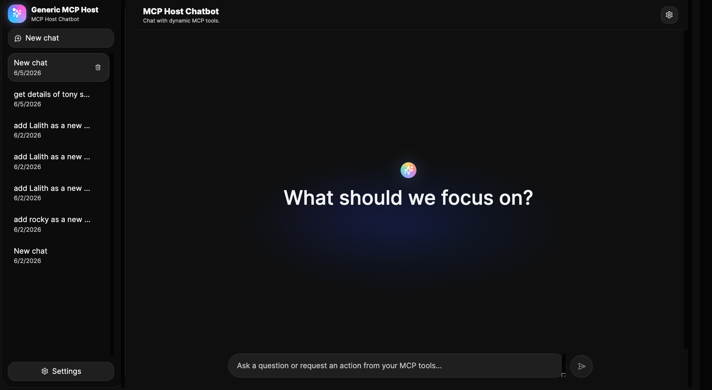
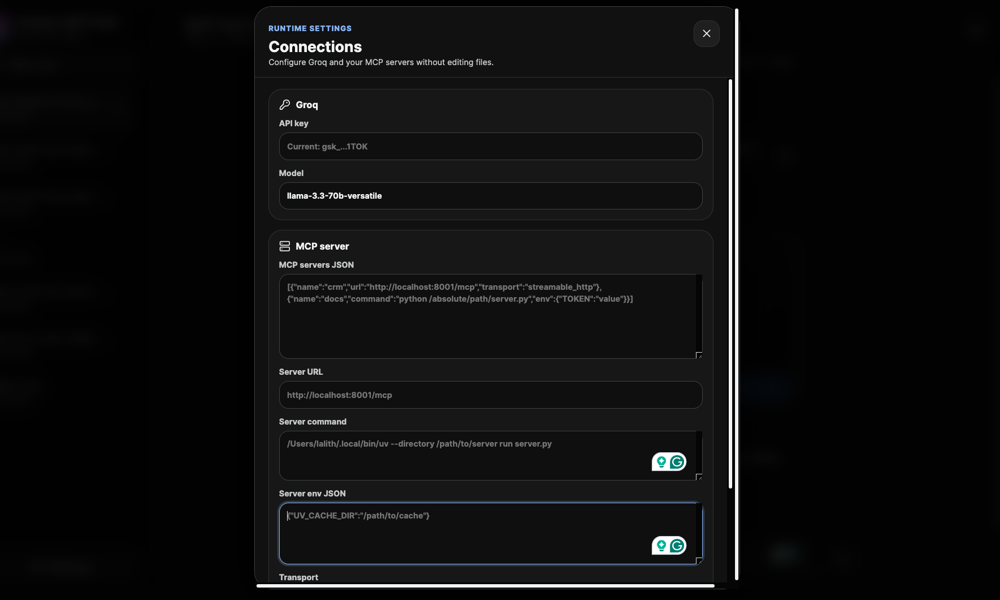
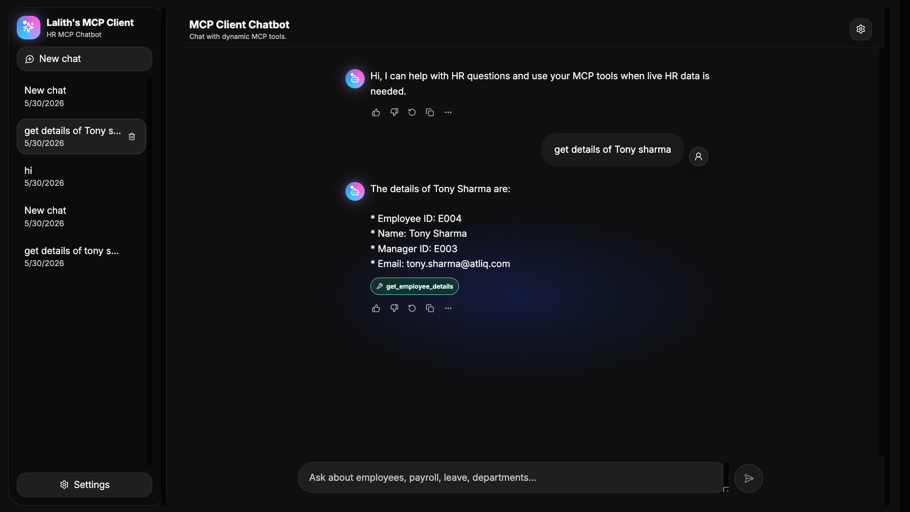

# Generic MCP Host Chatbot

A generic full-stack MCP host that connects a React chat UI to a FastAPI backend, uses Groq for chat completions, and dynamically discovers prompts and tools from one or more MCP servers.

This project is designed to work across domains. A company can connect internal MCP servers for CRM, HR, finance, documents, support, DevOps, analytics, or any other tool domain without hardcoding those tool names into the chatbot.

For the full architecture guide, see [PROJECT_DOCUMENTATION.md](PROJECT_DOCUMENTATION.md).

## Built With System Design And Codex

This project was built as a rapid prototype using a system design prompt and Codex as an AI coding agent. The goal was not just to generate code quickly, but to turn a clear architecture idea into a working full-stack application with backend APIs, frontend UI, runtime MCP configuration, tool-calling approval flow, logging, documentation, and GitHub-ready project structure.

AI coding agents can dramatically speed up prototype development. They are especially useful for moving from idea to implementation, wiring multiple layers together, exploring design alternatives, creating documentation, and iterating on user experience. A small team or solo developer can now build proof-of-concepts much faster than before.

But the quality of the result still depends on the human direction. System design knowledge, critical thinking, and product judgment are becoming more important in the world of AI coding, not less. The developer needs to understand what should be built, how the pieces should connect, what tradeoffs matter, where security and reliability risks are, and when generated code needs to be questioned or redesigned.

In that sense, AI agents are powerful builders, but system design is the map. The better the prompt, architecture, review process, and reasoning, the better the prototype becomes.

## Why An MCP Host?

MCP servers expose tools, prompts, and resources. An MCP host is the application layer that connects users and AI models to those capabilities.

Companies often need their own MCP host because they usually have:

- Multiple internal systems with different MCP servers.
- Private APIs and sensitive data that should stay behind company-controlled infrastructure.
- Runtime configuration needs across teams, environments, and domains.
- Approval, logging, and governance requirements before tools are executed.
- A single user experience that can call many tool backends safely.

This host acts as that company-controlled bridge. The model does not need hardcoded knowledge of every backend. The host discovers tools at runtime, exposes them to the model, asks the user for approval, routes approved calls to the right MCP server, and returns the result to the conversation.

## App Main Page

The main page is a chat-first MCP host interface. Users can start new sessions, continue previous chats, open runtime settings, and ask questions that may use one or more MCP tools.



## Runtime MCP Server Configuration

The host can be configured at runtime from the settings window. This lets you connect MCP servers without changing source code.



The settings window supports:

- Groq API key and model selection.
- A single MCP server URL for HTTP, streamable HTTP, or SSE.
- A single local stdio MCP server command.
- Server environment JSON for stdio servers.
- `MCP_SERVERS_JSON` for multiple named MCP servers.

When `MCP_SERVERS_JSON` is provided, it takes priority over the single-server fields. Each server can represent a different domain:

```env
MCP_SERVERS_JSON=[{"name":"crm","url":"http://localhost:8001/mcp","transport":"streamable_http"},{"name":"docs","command":"python /absolute/path/to/docs_server.py","env":{"TOKEN":"value"}}]
```

Tools and prompts are exposed with namespaced names like `crm__list_accounts` and `docs__search_docs`, so multiple servers can safely expose tools with the same original name.

## MCP Tool Calling Flow

When a user asks for something that needs live data or an external action, the host lets the model choose from the discovered MCP tools. The backend validates the selected tool, asks for user approval, calls the owning MCP server, and sends the tool result back to the model for a final response.



Tool calling works like this:

1. The frontend sends the latest user message and recent session history to `POST /api/chat`.
2. The backend discovers tools and prompts from each configured MCP server.
3. MCP capabilities are converted into Groq-compatible function tools.
4. Groq decides whether the user request needs an MCP tool.
5. If a tool is needed, the host returns an approval request to the UI.
6. After approval, the backend routes the call to the MCP server that owns the namespaced tool.
7. The MCP result is appended to the conversation as tool output.
8. Groq writes the final natural-language answer.

Tool names are never hardcoded. The backend uses whatever capabilities your MCP servers expose.

## Project Structure

```text
mcp_client_codex/
  backend/
    main.py                    # FastAPI routes
    config.py                  # Environment configuration
    models.py                  # Request/response schemas
    logging_config.py          # Console and rotating file logs
    services/
      groq_client.py           # Groq chat + tool-calling loop
      mcp_client.py            # MCP discovery, routing, and tool calls
      settings_store.py        # Runtime settings persistence
  frontend/
    src/
      api.js                   # Backend API client
      main.jsx                 # Chat UI
      styles.css               # UI styling
  screenshots/                 # README screenshots
  pyproject.toml               # Backend dependencies managed by uv
  .env.example                 # Backend environment template
```

## Backend Setup With uv

Install backend dependencies only inside this project `.venv`.

```bash
cd mcp_client_codex
uv venv
source .venv/bin/activate
uv pip install -e .
```

If you prefer a locked workflow after `uv` is available:

```bash
uv sync
```

## Backend Environment

```bash
cp .env.example .env
```

Edit `.env`:

```env
GROQ_API_KEY=your_groq_api_key_here
GROQ_MODEL=llama-3.3-70b-versatile

MCP_SERVER_URL=http://localhost:8001/mcp
MCP_TRANSPORT=streamable_http
```

Use `MCP_SERVER_URL` for HTTP/SSE MCP servers, or use `MCP_SERVER_COMMAND` for stdio:

```env
MCP_SERVER_COMMAND=python /absolute/path/to/your/mcp_server.py
MCP_SERVER_ENV_JSON={"SOME_SERVER_ENV":"value"}
```

For SSE:

```env
MCP_SERVER_URL=http://localhost:8001/sse
MCP_TRANSPORT=sse
```

For multiple MCP servers:

```env
MCP_SERVERS_JSON=[{"name":"crm","url":"http://localhost:8001/mcp","transport":"streamable_http"},{"name":"docs","command":"python /absolute/path/to/docs_server.py","env":{"TOKEN":"value"}}]
```

Each server object supports:

- `name`: required unique server name, using letters, numbers, `_`, or `-`
- `url`: HTTP/SSE MCP endpoint
- `command`: stdio command, used when `url` is not set
- `transport`: `auto`, `streamable_http`, or `sse`
- `env`: optional object of environment variables for stdio servers

## Run Backend

```bash
source .venv/bin/activate
uvicorn backend.main:app --reload --port 8000
```

Useful endpoints:

- `GET http://localhost:8000/api/health`
- `GET http://localhost:8000/api/tools`
- `POST http://localhost:8000/api/chat`
- `GET http://localhost:8000/api/settings`
- `PUT http://localhost:8000/api/settings`
- `DELETE http://localhost:8000/api/settings`

## Frontend Setup

Frontend dependencies stay isolated inside `frontend/node_modules`.

```bash
cd frontend
npm install
cp .env.example .env
npm run dev
```

Open:

```text
http://localhost:5173
```

## Backend Logs

The backend logs to the console and to rotating files under `logs/` by default:

```text
logs/app.log
logs/app.log.1
logs/app.log.2
```

Configure logging with:

```env
LOG_LEVEL=INFO
LOG_DIR=logs
LOG_FILE=app.log
LOG_MAX_BYTES=5000000
LOG_BACKUP_COUNT=5
```

Request timings, MCP discovery, MCP tool routing, approval decisions, and Groq errors are logged. Chat message bodies, tool arguments, API keys, and saved secrets are not logged by default.

## Error Handling

The backend handles:

- MCP connection failures
- MCP tool discovery issues
- Unavailable tool names
- Invalid JSON tool arguments
- MCP tool execution errors
- Groq API errors

If MCP discovery fails, the chatbot can still answer general questions through Groq, and the API response includes `tool_discovery_error` for debugging.
